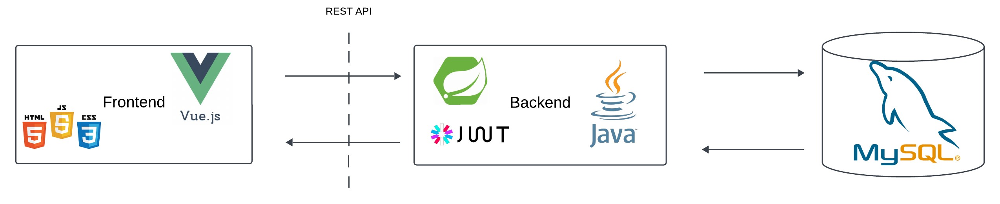
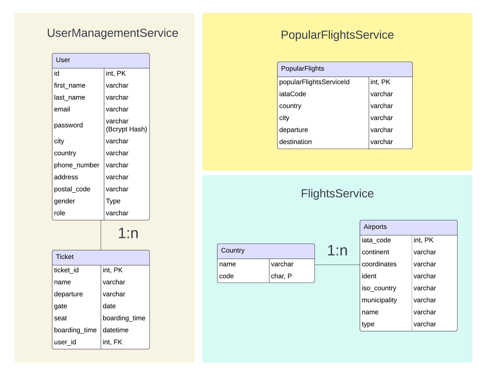
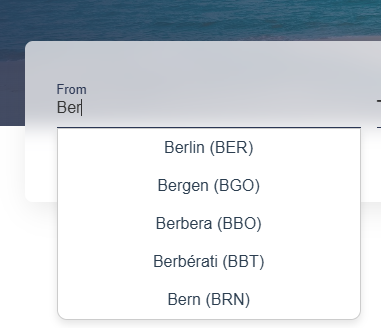

# Project Description
***
ArmanAir is a web application developed as part of a university project and utilizes a microservice-like architecture.
The application offers various functionalities for managing flights and user accounts.
<br><br>
The backend consists of three independent microservices, each responsible for a specific task and communicating with each other through REST interfaces.
<br><br>
The goal of the project is to replicate flight booking websites like Opodo or Fluege.de, which provide a user-friendly interaction with flight and ticket information.

---

## Contents


- [Architecture](#architecture)
- [Services in Detail](#services-in-detail)
    - [FlightsService](#flightservice)
    - [PopularFlightService](#popularflightservice)
    - [UserManagementService](#usermanagementservice)
- [Security](#security)
    - [FilterChain](#filterchain)
    - [JWT](#jwt)
- [API Documentation / Testing](#api-documentation-testing)


---

## Architecture
We follow the classic 3-Tier Architecture. The frontend repository can be found [here](#link). For the database, we use MySQL.
<br>
Schematic representation of our application:
<br>

The backend consists of 3 services, each responsible for a specific task.
<br>
The project structure looks like this:
```
WebTechProject_Backend/
├── FlightsService/ 
├── PopularFlightService/ 
├── UserManagementService/ 
└── DockerCompose.yml
```
With the Docker Compose file, the entire application can be started and tested locally. Simply run 
``` bash
         Docker Compose Up
```
in the terminal.
<br> Each service is structured as follows:
```
src/
├── controller/ Responsible for handling incoming HTTP requests
├── service/ Implements the business logic
├── repository/ JPA for accessing the database
├── dto/ Object representing the entities
Dockerfile-ServiceName
```
Additionally, each service has a Dockerfile, which we used for deployment.

The database consists of five tables, whose structures are represented as follows:

Four of the tables are linked through simple 1:n relationships. The fifth table, PopularflightsService, stands alone and has no connections to the other tables.

---
## Services in Detail
### <u>FlightsService </u>
The FlightsService (which could also be referred to as the AutocompleteService) offers an autocomplete function that provides users with relevant suggestions when typing search terms. For example, if a user enters "Ber", a list of possible matches like "Berlin" and "Bern" is returned.

These suggestions are limited to airports and cities. In the frontend, the list of suggested results is displayed, allowing the user to select a suitable city or airport.

<p align="center">  </p>
To achieve this, the FlightsService exposes the following REST API endpoint: /api/AirportRestAPI/municipality/{municipality} The airport data was extracted from datahub.io, cleaned, and then persisted in the database.

Example Request:
```
GET /api/AirportRestAPI/municipality/Berlin
```

Example Answer:
``` json
[
  {
    "id": 1,
    "name": "Flughafen Berlin Brandenburg",
    "city": "Berlin",
    "country": "Germany"
  },
  {
    "id": 2,
    "name": "Flughafen Tegel",
    "city": "Berlin",
    "country": "Germany"
  }
]
```

### <u>PopularFlightService (still in progress) </u>
The Popular Flight Service API will eventually offer CRUD functionalities to manage popular and most-booked flights. 
The API allows flight data to be created, retrieved, updated, and deleted. This API is designed to return flights based 
on the most popular ones among users.

### <u>UserManagementService </u>
The UserManagementService forms the core of the application and includes most of the functionalities. Its focus is on managing 
users and tickets. Additionally, security features are integrated, which we will discuss in more detail later.
This service includes two controllers, two repositories, and provides eight REST APIs that cover all aspects of user management.

#### AuthController
The AuthController class provides REST APIs for user management, authentication, and authorization. It allows the following functions:- Registrierung eines Benutzers
- User registration
- User login
- Token refresh
- Authentication check
- User data update
- Retrieve user details
The endpoints are available under /api/v1/auth, and except for signup, all paths are secured using JSON Web Tokens (JWT).

#### TicketController
The TicketController provides CRUD REST APIs for managing tickets.
These APIs are only accessible to authenticated users and allow:
- Retrieving a user's tickets
- Retrieving a single ticket
- Creating new tickets
- Deleting a ticket
The endpoints are available under /api/v1/tickets, and all paths are authorized with JWT.

For a more detailed description of each resource: [Swagger](https://usermanagementservice-v1-production.onrender.com/swagger-ui/index.html#)

---
## Security
Since the system stores sensitive user data like passwords, comprehensive security measures have been implemented to protect this data, prevent unauthorized access, and ensure secure system usage. This section introduces the key security precautions.


### FilterChain

The JWTAuthFilter is a security component in our system that ensures all incoming HTTP requests are checked before processing. The goal of the filter is to forward only authorized requests to protected resources and block unauthorized access.
1. **Checking the Authorization Header:**
   The filter checks if an incoming HTTP request contains an "Authorization" header.
- If this header is missing or empty, the request is immediately discarded and passed to the next filter in the chain.
- If the header is present, the JWT token is extracted and processed.

2. **Token Validation:**:  
   Using JWTUtils, the token is validated, and the user information (e.g., email) embedded within it is extracted.

3. **User Authentication:**
- If a valid token is found, the user is loaded via the UserService interface.
- A UsernamePasswordAuthenticationToken is created that contains the user's identity and associated permissions.
- This authentication token is stored in the SecurityContext of Spring Security, so the user is considered authenticated for the duration of the request.

### JWT
The JWTUtils class is a central component for creating, validating, and managing JSON Web Tokens (JWTs). These tokens play a key role in authentication and session management within the application.

1. **Token Creation**:
- **Access Token**: Short-lived tokens for authentication and authorization.
- **Refresh Token**: Tokens with additional information that can be used to renew an access token.

2. **Token Validation**:
- Checking if the token is valid and not expired.
- Matching token information with the user data.

3. **Information Extraction**:
- Extracting user information (e.g., Username) from the token.
- Processing and analyzing claims within the token.

---


## API Documentation / Testing

#### Test Strategy

The key REST APIs of the application are documented via [Swagger](https://usermanagementservice-v1-production.onrender.com/swagger-ui/index.html#). Swagger provides an intuitive interface where the available endpoints can be explored, understood, and tested directly. This interface gives detailed information about the available endpoints, their parameters, and the expected responses.

In the project folder, a **Postman folder** is available, which contains pre-configured requests for local testing of the APIs. To use these, ensure the application is running using **Docker Compose**. The pre-configured requests make testing different endpoints easier and reduce configuration efforts.

#### Testing Approach

For automated testing of the application, **MockMvc** is used. MockMvc is a framework that allows testing RESTful web services within a Spring application without starting an actual server. MockMvc is used to simulate HTTP requests to the controllers and verify their responses.

The tests focus on the **controller functionality** and ensure that all endpoints respond correctly to requests, returning the proper status codes and JSON responses.

#### Summary of Testing Strategy

- **Swagger**: Documentation and tests in an intuitive UI.
- **Postman**: Manual testing of APIs using pre-configured requests.
- **MockMvc**: Automated tests to ensure API functionality, especially for controllers.

This multi-layered testing strategy provides comprehensive coverage of API quality and usability. It allows both developers and testers to efficiently validate the functionality of the application.

---

## Contribute

If you would like to suggest improvements or bug fixes for this project, feel free to create a **Pull Request**. We appreciate any contributions!

## Contact

For questions or comments, you can reach out to us at **s0592847@htw-berlin.de** or **s0592355@htw-berlin.de**.