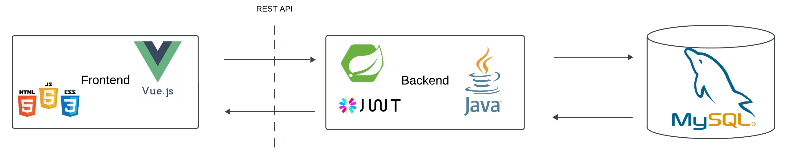

# Projektbeschreibung 
***
ArmanAir ist eine Webanwendung, welches im Rahmen eines Universitätsprojekt entwickelt wurde und eine Microservice ähnliche Architektur nutzt. 
Die Anwendung bietet verschiedene Funktionalitäten für die Verwaltung von Flügen und Nutzerkonten. 
<br><br>
Das Backend besteht aus drei unabhängigen Microservices, die jeweils eine spezifische Aufgabe übernehmen und über REST-Schnittstellen miteinander
kommunizieren.
<br><br>
Ziel des Projekts ist es, Flugbuchwebseiten ähnlich wie Opodo oder Fluege.de nachzuprogrammieren, die eine benutzerfreundliche Interaktion mit Flug- und Ticketinformationen ermöglichen.

---

## Inhalt


- [Architektur](#architektur)
- [Services im Detail](#services-im-detail)
  - [FlightsService](#flightservice)
  - [PopularFlightService](#popularflightservice)
  - [UserManagementService](#usermanagementservice)
- [Sicherheit](#sicherheit)
  - [FilterChain](#filterchain)
  - [JWT](#jwt)
- [API Dokumentation / Test](#api-dokumentation-test)


---

## Architektur
Wir folgen der klassischen 3-Tier Architecture. Das Frontend-Repository befindet sich [hier](#link). Für die Datenbank setzen wir auf MySQL.
<br>
Schematisch gesehen sieht unsere Anwendung wie folgt aus:
<br>

Das Backend besteht aus 3 Services, die jeweils für eine bestimmte Aufgabe tätig sind. 
<br>
Die Projektstruktur sieht so aus:
```
WebTechProject_Backend/
├── FlightsService/ 
├── PopularFlightService/ 
├── UserManagementService/ 
└── DockerCompose.yml
```
Mit der Docker Compose File lässt sich die ganze Anwendung lokal starten und testen.
Hier für einfach 
``` bash
         Docker Compose Up
```
in der Konsole ausführen.

<br>
Jeder Service ist in etwa wie folgt aufgebaut:

```
src/
├── controller/ Zuständig für die Verwaltung der eingehenden HTTP Anfragen
├── service/ Implementierung der Geschäftslogik
├── repository/ JPA um auf die Datenbank zuzugreifen
├── dto/ Objekt, welches die Entitäten repräsentiert
Dockerfile-Servicename
```
Zusätzlich hat jeder Service eine Dockerfile, welches wir für das deployment genutzt haben.

Die Datenbank umfasst insgesamt fünf Tabellen, deren Strukturen wie folgt dargestellt sind:


Vier der Tabellen sind durch einfache 1:n-Beziehungen miteinander verknüpft. Die fünfte Tabelle, PopularflightsService, steht jedoch isoliert und hat keine Verknüpfungen zu den anderen Tabellen.


---
## Services im Detail


### <u>FlightsService </u>
Das FlightsService (könnte man auch als AutocompleteService bezeichnen) bietet eine Autovervollständigungsfunktion, die Nutzern bei der Eingabe von Suchbegriffen relevante Vorschläge liefert. Gibt ein Nutzer beispielsweise "Ber" ein, wird eine Liste mit möglichen Treffern wie "Berlin" und "Bern" zurückgegeben.

Diese Vorschläge beschränken sich ausschließlich auf Flughäfen und Städte. Im Frontend wird die Liste der vorgeschlagenen Ergebnisse angezeigt, sodass der Nutzer daraus eine passende Stadt oder einen Flughafen auswählen kann.
<p align="center">
  
</p>

Dafür exposed der FlightsService die folgende REST API Schnittstelle: /api/AirportRestAPI/municipality/{municipality}
Die Daten für die Flughäfen wurde aus der Seite [datahub.io](https://datahub.io/core/airport-codes) entnommen, bereinigt und dann in der Datenbank persistiert.

Beispiel Anfrage:
```
GET /api/AirportRestAPI/municipality/Berlin
```

Beispiel Antwort:
``` json
[
  {
    "id": 1,
    "name": "Flughafen Berlin Brandenburg",
    "city": "Berlin",
    "country": "Germany"
  },
  {
    "id": 2,
    "name": "Flughafen Tegel",
    "city": "Berlin",
    "country": "Germany"
  }
]
```


### <u> PopularFlightService (noch in arbeit)</u>
Die Popular Flight Service API soll zukünftig  CRUD-Funktionalitäten anbieten, um beliebte und die meistgebuchtesten Flüge zu verwalten. 
Die API ermöglicht es, Flugdaten zu erstellen, abzurufen, zu aktualisieren und zu löschen. Diese API wurde entwickelt, 
um basierend auf den beliebtesten Flügen der Nutzer - Flüge zurück zu geben.


### <u>UserManagementService</u>

Der UserManagementService bildet das Herzstück der Anwendung und nimmt einen Großteil der Funktionalitäten ein. 
Sein Schwerpunkt liegt auf der Verwaltung von Nutzern und Tickets. Darüber hinaus sind Sicherheitsfunktionen integriert, 
auf die wir später näher eingehen werden.

Dieser Service umfasst zwei Controller, 2 Repositories und bietet acht REST-APIs, die sämtliche Aspekte der Nutzerverwaltung abdecken.

#### AuthController
Die `AuthController`-Klasse stellt REST-APIs für die Benutzerverwaltung, Authentifizierung und Autorisierung bereit. Sie ermöglicht folgende Funktionen:
- Registrierung eines Benutzers
- Anmeldung eines Benutzers
- Token-Aktualisierung (Refresh)
- Überprüfung der Authentifizierung
- Aktualisierung von Benutzerdaten
- Abrufen von Benutzerdetails

Die Endpunkte sind unter `/api/v1/auth` verfügbar. Hier bei wird auf JSON Web Tokens gesetzt, außer signup werden alle Pfade mittels JWT autorisiert.

#### TicketController
Der `TicketController` stellt CRUD-REST-APIs für die Verwaltung von Tickets bereit.  
Diese APIs sind nur für authentifizierte Benutzer zugänglich und ermöglichen:
- Abrufen von Tickets eines Benutzers
- Abrufen eines einzelnen Tickets
- Erstellen von neuen Tickets
- Löschen eines Tickets

Die Endpunkte sind unter `/api/v1/tickets` verfügbar.  Alle Pfade werden mittels JWT autorisiert.

Für eine genauere Beschreibung der einzelnen Ressourcen : [Swagger](https://usermanagementservice-v1-production.onrender.com/swagger-ui/index.html#)

---
## Sicherheit
Da im System sensible Nutzerdaten wie Passwörter gespeichert werden, haben wir umfassende Sicherheitsmaßnahmen implementiert, 
um diese Daten zu schützen, unbefugten Zugriff zu verhindern und eine sichere Nutzung des Systems zu gewährleisten. 
In diesem Abschnitt werden die wichtigsten Sicherheitsvorkehrungen vorgestellt.


### FilterChain

Der **JWTAuthFilter** ist eine Sicherheitskomponente in unserem System, die sicherstellt, dass alle eingehenden HTTP-Anfragen vor ihrer Verarbeitung überprüft werden. Ziel des Filters ist es, nur autorisierte Anfragen an geschützte Ressourcen weiterzuleiten und unautorisierte Zugriffe abzuwehren.

1. **Prüfen des Authorization-Headers**:  
   Der Filter überprüft, ob eine eingehende HTTP-Anfrage einen "Authorization"-Header enthält.
  - Falls dieser Header fehlt oder leer ist, wird die Anfrage sofort verworfen und an den nächsten Filter in der Kette weitergeleitet.
  - Ist der Header vorhanden, wird dessen JWT-Token extrahiert und weiterverarbeitet.

2. **Validierung des Tokens**:  
   Mithilfe der **JWTUtils** wird das Token auf Gültigkeit geprüft, und die darin gespeicherte Benutzerinformation (z. B. die E-Mail-Adresse) wird extrahiert.

3. **Benutzerauthentifizierung**:
  - Wenn ein gültiges Token vorliegt, wird der Benutzer über das **UserService**-Interface geladen.
  - Es wird ein **UsernamePasswordAuthenticationToken** erstellt, das die Benutzeridentität und die zugehörigen Berechtigungen enthält.
  - Dieses Authentifizierungs-Token wird im **SecurityContext** von Spring Security gespeichert, sodass der Benutzer für die Dauer der Anfrage als authentifiziert gilt.

### JWT 
Die Klasse **JWTUtils** ist eine zentrale Komponente für die Erzeugung, Validierung und Verwaltung von JSON Web Tokens (JWTs). Diese Tokens spielen eine Schlüsselrolle bei der Authentifizierung und Sitzungsverwaltung in der Anwendung.

1. **Token-Erzeugung**:
  - **Access Token**: Kurzlebige Tokens zur Authentifizierung und Autorisierung.
  - **Refresh Token**: Tokens mit zusätzlicher Information, die zur Erneuerung eines Access Tokens verwendet werden können.

2. **Token-Validierung**:
  - Überprüfen, ob das Token gültig und nicht abgelaufen ist.
  - Abgleichen der Token-Informationen mit den Benutzerdaten.

3. **Informationsextraktion**:
  - Extrahieren von Benutzerinformationen (z. B. Username) aus dem Token.
  - Verarbeiten und Analysieren von Claims im Token.

---
## API Dokumentation / Test

#### Teststrategie

Die wichtigsten REST APIs der Anwendung sind über [Swagger](https://usermanagementservice-v1-production.onrender.com/swagger-ui/index.html#) dokumentiert. Mit Swagger können die Endpunkte übersichtlich eingesehen, deren Funktionalität verstanden und direkt getestet werden. Diese benutzerfreundliche Oberfläche bietet detaillierte Informationen zu den verfügbaren Endpunkten, deren Parametern und den erwarteten Antworten.

Im Projektordner befindet sich ein **Postman-Ordner**, der vorbereitete Anfragen enthält, die zum lokalen Testen der APIs genutzt werden können. Voraussetzung dafür ist, dass die Anwendung mit **Docker Compose** gestartet wurde. Die vorgefertigten Anfragen erleichtern das Testen der verschiedenen Endpunkte und reduzieren den Konfigurationsaufwand.

#### Testansatz

Für die automatisierten Tests der Anwendung wurde **MockMvc** verwendet. MockMvc ist ein Framework, das es ermöglicht, RESTful-Webservices in einer Spring-Anwendung zu testen, ohne einen echten Server zu starten. MockMvc wird verwendet, um HTTP-Anfragen an die Controller zu simulieren und die Antworten zu überprüfen.

Die Tests konzentrieren sich auf die **Controller-Funktionalitäten** und stellen sicher, dass alle Endpunkte korrekt auf Anfragen reagieren und die richtigen Statuscodes sowie JSON-Antworten zurückgeben.

#### Zusammenfassung der Teststrategie

- **Swagger**: Dokumentation und Tests in einer übersichtlichen UI.
- **Postman**: Manuelle Tests der APIs mit vorgefertigten Anfragen.
- **MockMvc**: Automatisierte Tests zur Sicherstellung der API-Funktionalität, insbesondere der Controller.

Diese mehrschichtige Teststrategie bietet eine umfassende Absicherung der API-Qualität und Benutzerfreundlichkeit. Sie ermöglicht es sowohl Entwicklern als auch Testern, die Funktionalität der Anwendung effizient zu validieren.

---
## Beitrag leisten
Wenn Sie Verbesserungen oder Fehlerbehebungen für dieses Projekt vorschlagen möchten, sind Sie herzlich eingeladen, einen **Pull Request** zu erstellen. Wir freuen uns über jede Art von Beitrag!

## Kontakt
Bei Fragen oder Anmerkungen können Sie mich gerne unter **s0592847@htw-berlin.de** oder **s0592355@htw-berlin.de** kontaktieren.


